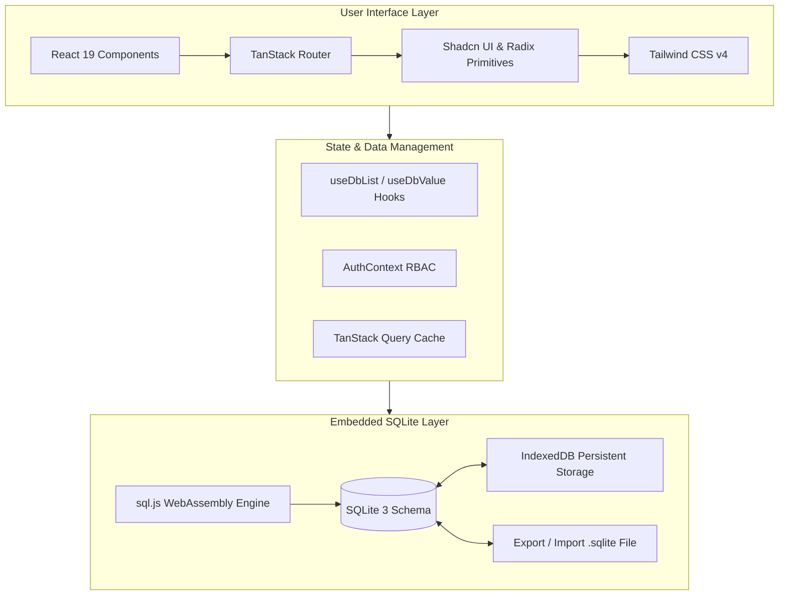

# PulseERP

[](https://www.typescriptlang.org/)
[](https://react.dev/)
[](https://tanstack.com/)
[-003B57.svg>)](https://sqlite.org/)
[](https://tailwindcss.com/)
[](LICENSE)

**PulseERP** is a modern, high-performance Enterprise Resource Planning (ERP) system designed for retail, e-commerce, and wholesale businesses. It delivers complete visibility and control over inventory, orders, multi-step deliveries, supplier procurement, and corporate finance within a clean, intuitive, and responsive dashboard.

Powered by an embedded **SQLite 3 WebAssembly engine** with persistent browser storage (IndexedDB), PulseERP operates with zero external database dependencies while providing full SQL query power, atomic multi-table transactions, and portable `.sqlite` database export and restore.

---

## Key Features

### 1. Executive Dashboard & Analytics

- **Live Metrics**: Real-time KPI summaries for total revenue, gross profit, pending orders, low stock, and net balance.
- **Interactive Visualizations**: Dynamic revenue, expense, and order distribution charts built with Recharts.
- **Audited Financial Summaries**: Live calculations of total receivables, supplier payables, and net cash flow.

### 2. Inventory & Product Lifecycle

- **Product Catalog**: Comprehensive catalog with SKU, barcode, brand, category, and supplier linking.
- **Landed Cost & Margin Modeling**: Detailed per-unit cost structure accounting for manufacturing, shipping, packaging, marketing, transaction fees, and customs/duties.
- **Multi-State Stock Tracking**: Track current, minimum safety threshold, reserved, and damaged stock levels.
- **Stock Adjustments**: Audit-logged manual adjustments with reason tracking and automated stock level recalculation.
- **Categories & Brands**: Hierarchical catalog classification with instant filtering.

### 3. Orders, Pre-Orders & Fulfillment

- **Full Order Lifecycle**: Manage orders through `pending`, `processing`, `shipped`, `delivered`, `returned`, and `cancelled` states.
- **Atomic Stock Deduction**: Automatically decrements product inventory in an atomic transaction upon order delivery.
- **Pre-Order Tracking**: Handle custom bookings, advance deposit receipts, and scheduled fulfillment dates.
- **Dispatch & Deliveries**: Courier assignment, tracking numbers, delivery costs, and transit progress monitoring.
- **Thermal POS Shipping Labels**: Generate and print standardized 50x75mm thermal labels with Code128 barcodes and dynamic QR codes.
- **PDF Invoice Generation**: Auto-generate downloadable and printable professional PDF invoices with company branding.

### 4. Supplier Procurement & Purchasing

- **Supplier Directory**: Ledger tracking total purchases, paid amounts, and outstanding balance due.
- **Purchase Orders**: Multi-item procurement orders with shipping and handling allocations.
- **Automated Restocking**: Receiving a purchase order atomically increases inventory and updates unit cost metrics.

### 5. Corporate Finance & Investor Management

- **Operational Expenses**: Multi-category expense tracking (advertising, courier, packaging, salaries, rent, utilities).
- **Investor Relations**: Track equity partners, invested capital, and calculate proportional profit distribution.
- **Loans & Repayments**: Monitor outstanding principal, interest rates, repayment schedules, and settlement history.
- **Profit Simulator**: Scenario modeling for marketing ROI, pricing variations, and net profit projections.

### 6. Role-Based Access Control (RBAC) & Audit Trails

- **Granular Roles**: Role-scoped permissions (`super_admin` and `moderator`).
- **Cryptographic Security**: Passwords hashed using salted SHA-256 via the Web Crypto API.
- **Audit Logging**: Comprehensive, immutable activity log recording user ID, role, action, target entity, timestamp, and metadata.

### 7. SQLite Engine & Database Portability

- **Embedded WebAssembly Engine**: 100% standard SQLite 3 running locally with zero external network latency.
- **Persistent IndexedDB Storage**: Automatically syncs database binary changes to the browser's persistent storage.
- **Single-File Backup**: Export the entire system database as a standard `.sqlite` file at any time.
- **Database Restore**: Upload and hot-swap `.sqlite` files to restore previous backups or transfer environments.

---

## Architecture & Technology Stack



| Component        | Technology                                                                              | Description                                                 |
| :--------------- | :-------------------------------------------------------------------------------------- | :---------------------------------------------------------- |
| **Framework**    | [TanStack Start](https://tanstack.com/start) / [Vite](https://vitejs.dev/)              | Fullstack framework with file-based routing and SSR support |
| **Language**     | [TypeScript](https://www.typescriptlang.org/)                                           | Strongly typed codebase with end-to-end interface safety    |
| **Database**     | [SQLite 3 (sql.js)](https://sql.js.org/)                                                | Embedded WebAssembly relational database                    |
| **Persistence**  | [IndexedDB](https://developer.mozilla.org/en-US/docs/Web/API/IndexedDB_API)             | Persistent local browser storage for SQLite binary state    |
| **Styling**      | [Tailwind CSS v4](https://tailwindcss.com/)                                             | Modern utility-first CSS engine                             |
| **Components**   | [Radix UI](https://www.radix-ui.com/) / [Lucide](https://lucide.dev/)                   | Accessible primitives and vector icon library               |
| **Charts**       | [Recharts](https://recharts.org/)                                                       | Responsive SVG charts for revenue and profit visualization  |
| **PDF & Labels** | [jsPDF](https://github.com/parallax/jsPDF) / [JsBarcode](https://lindell.me/JsBarcode/) | Invoice document generator and thermal barcode printer      |

---

## Database Schema Overview

The embedded SQLite database organizes business records into normalized relational tables, storing queryable indexed columns alongside structured JSON payloads:

```sql
users            -- Authentication, salted password hashes, roles, active status
products         -- Inventory items, SKU, categories, pricing, stock levels
categories       -- Catalog groupings
brands           -- Brand designations
suppliers        -- Vendor profiles, purchase ledger, due amounts
orders           -- Sales orders, customer details, line items, status
pre_orders       -- Advance orders and expected delivery schedules
deliveries       -- Shipping dispatch, courier tracking, charges
returns          -- Customer returns and restock audits
purchases        -- Inbound procurement invoices and supplier items
expenses         -- Operating expenditures and classifications
investments      -- Capital funding deposits
investors        -- Shareholder profiles and equity percentages
loans            -- Borrowings, principal, interest, and terms
loan_repayments  -- Scheduled loan installments and payments
stock_history    -- Audit ledger for adjustments, damages, and restocks
audit_logs       -- System-wide activity logs
notifications    -- Low-stock warnings and administrative alerts
settings         -- Company details, currency, default thresholds
```

---

## Getting Started

### Prerequisites

- [Node.js](https://nodejs.org/) (v20.0.0 or higher recommended)
- [npm](https://www.npmjs.com/) (v10+), [pnpm](https://pnpm.io/), or [bun](https://bun.sh/)

### Installation

1. **Clone the repository**:

   ```bash
   git clone https://github.com/your-username/pulse-erp.git
   cd pulse-erp
   ```

2. **Install dependencies**:

   ```bash
   npm install
   ```

3. **Start the development server**:

   ```bash
   npm run dev
   ```

4. **Access the application**:
   Open your browser and navigate to:
   ```
   http://localhost:5173
   ```

---

## Default Credentials

PulseERP automatically provisions default administrative credentials on initial startup:

| Field        | Value                |
| :----------- | :------------------- |
| **Email**    | `admin@pulseerp.com` |
| **Password** | `admin123`           |
| **Role**     | `super_admin`        |

> [!TIP]
> You can create additional administrators or moderators with custom roles directly from the **Admins** page (`/_authenticated/admins`).

---

## Available Scripts

| Command           | Action                                                               |
| :---------------- | :------------------------------------------------------------------- |
| `npm run dev`     | Starts the local Vite development server with hot module replacement |
| `npm run build`   | Builds the client bundle and compiles the Nitro server entry         |
| `npm run preview` | Previews the production build locally                                |
| `npm run lint`    | Runs ESLint across all TypeScript and React files                    |
| `npm run format`  | Formats all code using Prettier according to `.prettierrc` rules     |

---

## Database Management & Backups

PulseERP provides a built-in database management center under **Settings** (`/_authenticated/settings`):

- **Export SQLite Database**: Generates and downloads a binary `.sqlite` database snapshot (`pulse-erp-YYYY-MM-DD.sqlite`). This file can be inspected using standard tools like [DB Browser for SQLite](https://sqlitebrowser.org/) or [DBeaver](https://dbeaver.io/).
- **Import SQLite Database**: Upload any compatible `.sqlite` backup to immediately restore all tables, users, orders, and financial history.
- **Reset to Defaults**: Resets the database to clean demo data.

---

## Project Structure

```
biz-weaver-ui/
├── public/                     # Static assets and WebAssembly binaries
│   └── sql-wasm.wasm           # SQLite WebAssembly binary
├── src/
│   ├── components/             # Reusable UI components
│   │   ├── admin/              # ERP application shell, tables, dialogs
│   │   └── ui/                 # Radix UI + Tailwind design system
│   ├── hooks/                  # Custom React hooks
│   ├── lib/                    # Core business logic & database services
│   │   ├── auth-context.tsx    # SQLite-backed RBAC & session provider
│   │   ├── calc.ts             # Financial math, margins, and simulator calculations
│   │   ├── db.ts               # Reactive database hooks (useDbList, useDbValue, CRUD)
│   │   ├── format.ts           # Currency, numbers, and date formatters
│   │   ├── sqlite.ts           # SQLite engine, schema DDL, and IndexedDB sync
│   │   └── types.ts            # TypeScript interfaces and domain models
│   ├── routes/                 # File-based TanStack Router route tree
│   │   ├── __root.tsx          # Root layout shell
│   │   ├── auth.tsx            # Login and authentication portal
│   │   ├── _authenticated.tsx  # Authenticated route guard
│   │   └── _authenticated.*    # Dashboard, inventory, orders, finance pages
│   ├── router.tsx              # Router instantiation
│   ├── server.ts               # Server entry point
│   └── styles.css              # Global styles and Tailwind directives
├── package.json
├── tsconfig.json
└── vite.config.ts
```

---

## License

This project is open-source and licensed under the [MIT License](LICENSE).
